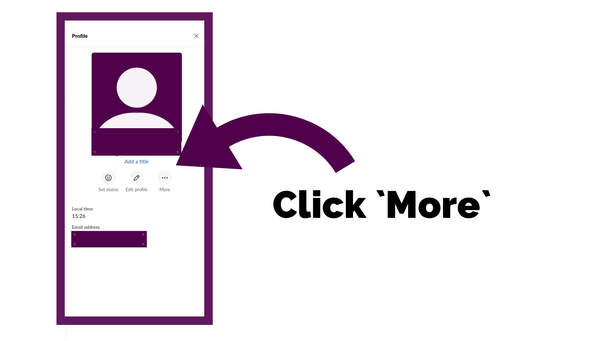
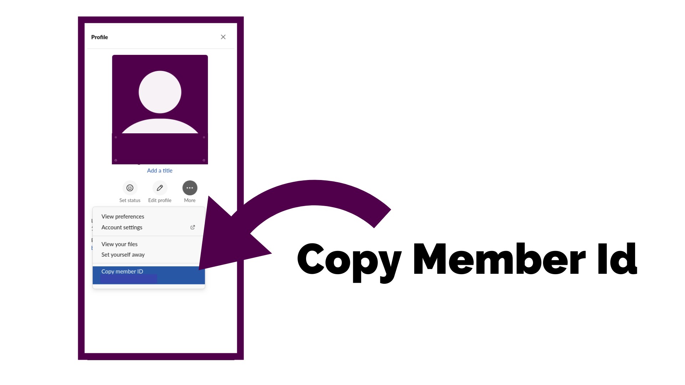
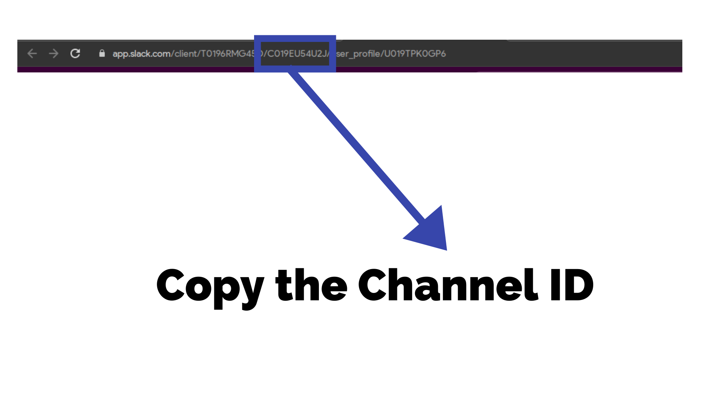

# Slack-Bot
Slack bot to extract the AMA session chats and convert it to JSON for FAQs!

## How to use this script?
1. Install Python v3 from the [official site](https://www.python.org/downloads/release/python-382).

2. Clone this [repo](https://github.com/Navayuvan-SB/Slack-Bot).

3. Get into the clonned repo.
    
4. Install the required packages
    ```
    pip install -r requirements.txt
    ```
    (or)
    ```
    pip3 install -r requirements.txt
    ```

5. Create a `.env` file.

6. Define the variables in the `.env` file as below
    ```
    CHANNEL_ID=###########
    OAUTH_TOKEN=####-##########-###########-###################
    ```

7. Run the script and enter the required details
    ```
    python gen-faqs.py
    ```
    (or)
    ```
    python3 gen-faqs.py
    ```

## Where do I get the User ID?

1. Open your Slack app/site

2. Goto the user profile

3. Click more

    

4. Copy Member ID

    

## Where do I get the Channel ID?
1. Open your Slack channel in browser

2. Look for this part in the URL as shown in the image.

    

3. The Highlighted string is your channel ID.

## Where do I get the OAUTH TOKEN?

1. Visit [api.slack.com](https://api.slack.com/apps?new_app=1)

2. Create a new Slack App

3. Goto `OAuth & Permissions` in `Features` section.

4. Scroll down and add the following scopes
    
    - `channels:history`
    - `channels:read`
    - `incoming-webhook`

5. Click `Reinstall App` at the top.

6. Use the `Bot User OAuth Access Token`